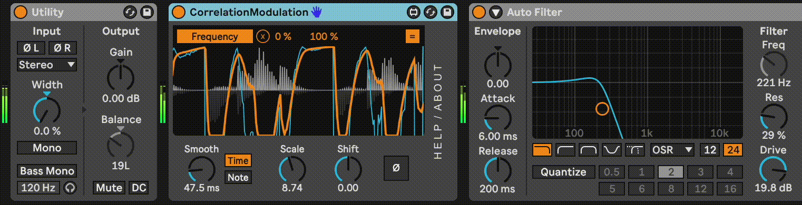

# m4l-CorrelationModulation
## Use left/right phase correlation as a modulation source.

This is a Max For Live device that uses a stereo signal's left/right phase correlation as a modulation source to control other parameters. It has adjustable smoothing, shift, and scale controls.

A mono signal has a correlation value of 1. A stereo signal that is perfectly out of phase has a correlation value of 0. A , as does a signal at 100% volume in one channel and silence in the other. This device allows you to map that correlation value to up to 8 other parameters in your Live Set.

### Changelog

Direct download links below.
* [DOWNLOAD v2](https://github.com/zsteinkamp/m4l-CorrelationModulation/raw/main/frozen/Correlation%20Modulation%20v2.amxd) - 2024-08-17 - Support Live 12 Modulation mode; General improvements and UI touch-ups
* [v1](https://github.com/zsteinkamp/m4l-CorrelationModulation/raw/main/frozen/CorrelationModulation-1.amxd) - 2023-12-09 - Initial Version

## Installation / Setup

If you just want to download and install the device, then go to the [frozen/](https://github.com/zsteinkamp/m4l-CorrelationModulation/tree/main/frozen) directory and download the newest `.amxd` file there. You can also download it directly via the links in [*Changelog*](#changelog).

## Usage

Add the device to an instrument or MIDI track. The left/right phase correlation of the incoming stereo audio signal is calculated, smoothed, scaled and shifted. The resulting signal can be used to modulate other parameters in your device chains.

### Smooth
Use the `Smooth` dial to control how many samples are averaged to produce the output value. A higher number will produce smoother output. You can control the smoothing by time or with a note value.

### Curve
Adjusts the power of the curve mapping to the output values. Higher numbers have exaggerated responses to changes in correlation.

### Scale
Scales the output value by the specified value.

### Invert
Inverts the output signal.

### Shift
Increases or decreases the output value by a fixed amount.

## Common Problems

#### ...
...

## TODOs
* ...

