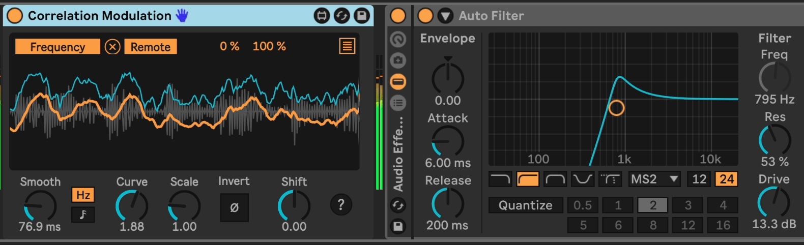

# m4l-CorrelationModulation
## Use left/right correlation as a modulation source.

This is a Max For Live device that uses a stereo signal's left/right correlation as a modulation source to control other parameters. It has adjustable smoothing, shift, and scale controls.

### Changelog

Direct download links below.
* [DOWNLOAD v1](https://github.com/zsteinkamp/m4l-CorrelationModulation/raw/main/frozen/CorrelationModulation-v1.amxd) - 2023-12-09 - Initial Version

## Installation / Setup

If you just want to download and install the device, then go to the [frozen/](https://github.com/zsteinkamp/m4l-CorrelationModulation/tree/main/frozen) directory and download the newest `.amxd` file there. You can also download it directly via the links in [*Changelog*](#changelog).

## Usage

Add the device to an instrument or MIDI track. The left/right correnaltion of the incoming stereo audio signal is calculated, smoothed, scaled and shifted. The resulting signal can be used to modulate other parameters in your device chains.

### Smooth
Use the `Smooth` dial to control how many samples are averaged to produce the output value. A higher number will produce smoother output.

### Shift
Increases or decreases the output value by a fixed amount.

### Scale
Scales the output value by the specified value.

## Common Problems

#### ...
...

## TODOs
* ...

